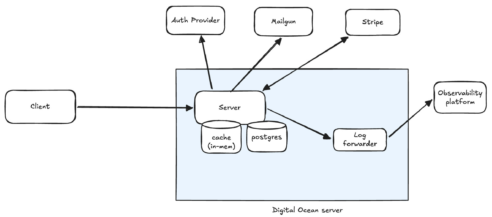

# Keto Granola

Monorepo for Keto Granola e-commerce platform.

## App architecture


Cloudflare acts as a full proxy caching static assets and SSR HTML, forwarding cache misses to the backend server. The server renders all routes via `html/template`, with React islands hydrating interactive components 
client-side. 

## Structure

- `/frontend` — Vite + React islands. Embedded into the Go binary at build time. See [frontend/README.md](./frontend/README.md)
- `/backend` — Go + Echo. See [backend/README.md](./backend/README.md)

The frontend has no standalone runtime. Its build output is embedded into the Go binary and served directly by Echo. The only thing that runs in production is the single backend image.

## Local Development

### Prerequisite file:
- env (see [.env.example](.env.example))

### Run everything via Docker:

- Start:
```
make up
```

- Force rebuild after making changes:
```
make up/build
```

- Stop:
```
make down
```

- Stop and remove volumes (wipes DB):
```
make down/vol
```

### Run everything without Docker

The postgres DB always runs via Docker.

Backend:
```
docker compose up -d postgres
cd backend
make dep
make run
```

See [`backend/README.md`](backend/README.md) for linting, testing, etc.

Frontend:
```
cd frontend
make dep
make run
```

See [`frontend/README.md`](frontend/README.md) for linting, testing, etc.


